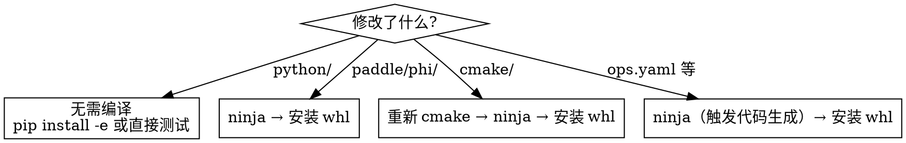

# Paddle 源码编译

## 概览

Paddle 使用 CMake + Ninja 构建。典型流程：cmake 配置 → ninja 编译 → whl 打包安装。修改 C++/CUDA 代码后需重新编译才能生效。

## 编译流程

### 1. 环境准备（venv）

```bash
cd /workspace/Paddle
uv venv --relocatable --seed --python 3.10   # 首次创建
source .venv/bin/activate
uv pip install -r python/requirements.txt
uv pip install func_timeout pandas numpy "numpy<2.0"
```

若 `.venv` 已存在，直接 `source .venv/bin/activate` 即可。

### 2. CMake 配置

```bash
mkdir -p build && cd build
cmake .. \
  -GNinja \
  -DCMAKE_BUILD_TYPE=Release \
  -DCMAKE_EXPORT_COMPILE_COMMANDS=ON \
  -DPY_VERSION=3.10 \
  -DPADDLE_VERSION=0.0.0 \
  -DCUDA_ARCH_NAME=Auto \
  -DWITH_GPU=ON \
  -DWITH_DISTRIBUTE=ON \
  -DWITH_CINN=ON \
  -DWITH_UNITY_BUILD=OFF \
  -DWITH_TESTING=OFF
```

配置只需首次执行或 CMake 选项变更时重新执行。

### 3. 编译

```bash
ninja -j$(nproc)
```

Ninja 自动增量编译，仅重编变更文件及其依赖。

### 4. 安装

```bash
cd /workspace/Paddle
uv pip install build/python/dist/*.whl --no-deps --force-reinstall
```

`--no-deps` 跳过依赖解析加速安装，`--force-reinstall` 确保覆盖旧版。

## 常用 CMake 选项

| 选项 | 默认 | 说明 |
|------|------|------|
| `WITH_GPU` | ON(有CUDA时) | GPU 支持 |
| `WITH_DISTRIBUTE` | OFF | 分布式训练 |
| `WITH_CINN` | OFF | CINN 编译器 |
| `WITH_TESTING` | ON | C++ 单测（关闭可加速编译） |
| `WITH_UNITY_BUILD` | OFF | 合并编译单元加速（可能掩盖头文件问题） |
| `CUDA_ARCH_NAME` | Auto | GPU 架构，Auto 自动检测当前卡 |
| `CMAKE_BUILD_TYPE` | Release | Debug 可调试但更慢 |
| `CMAKE_EXPORT_COMPILE_COMMANDS` | OFF | 生成 `compile_commands.json` 供 clangd 使用 |
| `WITH_TENSORRT` | OFF | TensorRT 推理加速 |
| `WITH_ROCM` | OFF | AMD ROCm 支持 |
| `WITH_XPU` | OFF | 百度昆仑 XPU 支持 |

## 增量编译策略



- **仅改 Python**：无需编译。如果已 `pip install -e .` 或在 `build/python` 下测试，改动即时生效。
- **改 C++/CUDA**：`cd build && ninja -j$(nproc)` + 重新安装 whl。
- **改 CMake 配置**：需重新 `cmake ..` 再 `ninja`。
- **改 YAML（ops.yaml / backward.yaml）**：ninja 会自动触发代码生成脚本。

## 检查已有构建产物

复用已有 build 可大幅节约时间：

```bash
# 检查是否已有 whl
ls build/python/dist/*.whl 2>/dev/null && echo "已有构建产物" || echo "需要编译"

# 检查 compile_commands.json（clangd 需要）
ls build/compile_commands.json 2>/dev/null
```

## 常见编译问题

| 症状 | 原因 | 解决 |
|------|------|------|
| `ninja: error: loading 'build.ninja'` | 未执行 cmake 配置 | 先执行 cmake 命令 |
| CUDA arch 不匹配 | `CUDA_ARCH_NAME` 与实际 GPU 不符 | 设为 `Auto` 或指定具体架构 |
| 链接时 OOM | 并行链接占用过多内存 | `ninja -j4` 减少并行度 |
| protobuf 版本冲突 | 系统 protobuf 与编译版本不一致 | 在 venv 内编译，隔离系统包 |
| `ccache` 缓存失效导致全量重编 | 头文件路径变更 | 清理 ccache: `ccache -C` |
| whl 安装后 import 报错 | 旧 .so 残留 | `--force-reinstall` 或清理 `site-packages/paddle` |

## 完整一键编译示例

```bash
cd /workspace/Paddle
source .venv/bin/activate
cd build
ninja -j$(nproc) && cd .. && uv pip install build/python/dist/*.whl --no-deps --force-reinstall
```

## 调试编译（Debug 模式）

需要 gdb 调试 C++ 代码时，将 `CMAKE_BUILD_TYPE` 改为 `Debug`：

```bash
cmake .. -GNinja -DCMAKE_BUILD_TYPE=Debug [其他选项...]
ninja -j$(nproc)
```

Debug 模式编译产物更大、运行更慢，仅在需要调试时使用。

## 关键目录

| 目录 | 说明 |
|------|------|
| `build/` | 构建产物根目录 |
| `build/python/dist/` | 生成的 whl 文件 |
| `build/compile_commands.json` | clangd 索引文件 |
| `paddle/phi/kernels/` | PHI kernel 源码 |
| `paddle/phi/ops/yaml/` | 算子 YAML 定义 |
| `cmake/` | CMake 模块和工具链 |
